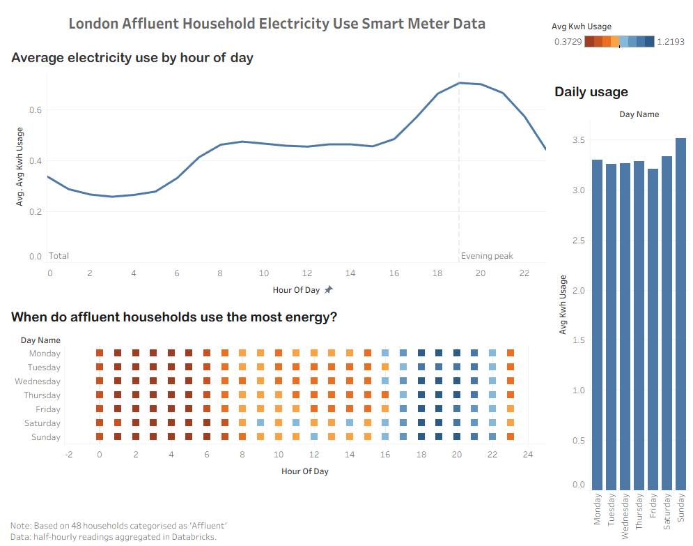

# Tableau

- **Workbook:** [`London_energy.twb`](London_energy.twb)
- **Data source:** [`../data/exports/london_energy_tableau.csv`](../data/exports/london_energy_tableau.csv)

Open the workbook from this folder in Tableau Desktop. If the data connection breaks after cloning the repo, point it at `data/exports/london_energy_tableau.csv`.

Add a dashboard screenshot to `screenshots/` for GitHub preview.

If published to Tableau Public, add the live URL to the root [README.md](../README.md).
